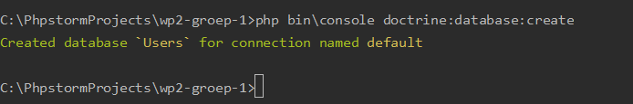
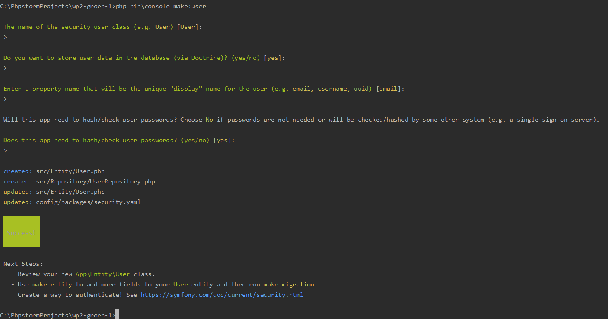
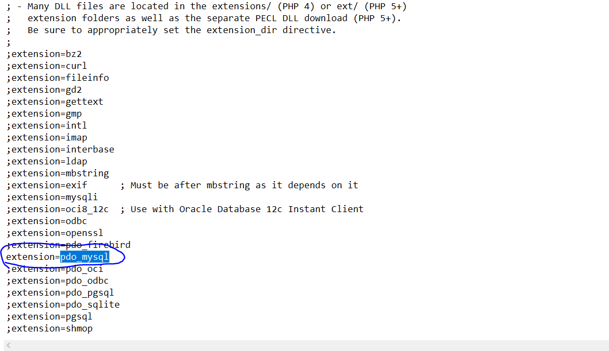
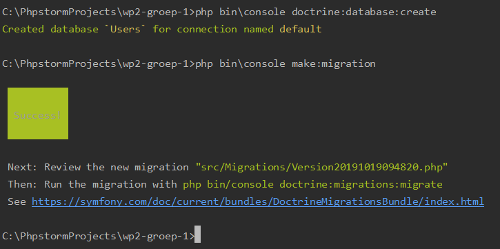
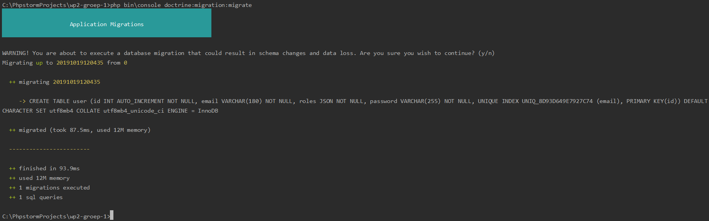

# Web & Mobile: WP2

## Create Users

We will use a database Users to store our users with roles administrators,
moderators and custodians. First, set your database connection string in the
.env file:

Then, run the following command, which will create the Users database:

To create the Users class ( for which we will later provide theAdministrator, 
Moderator and Custodian roles) we can use the Symfony MakerBundle:

This will create a User class  with a unique field 'email' and a hashed password. 
This entity will be managed by Doctrine.

To enable the pdo_mysql driver Doctrine uses to create migrations,
navigate to the php.ini file in the directory where your PHP installation
is located on your host machine, and uncomment the following line:

Now, run the following command to create the first migration to the
Users database, which will create the tables for our users:

Finally, we can migrate this initial migration using the following command:

## The "User Provider"

A "User Provider" is a class that helps with specific user features such as
a "remember me" feature and impersonation.

## Roles for our users

Coming soon!

## Credits
Peter Janssen & Ben Merken @ Hogeschool PXL, 2019.